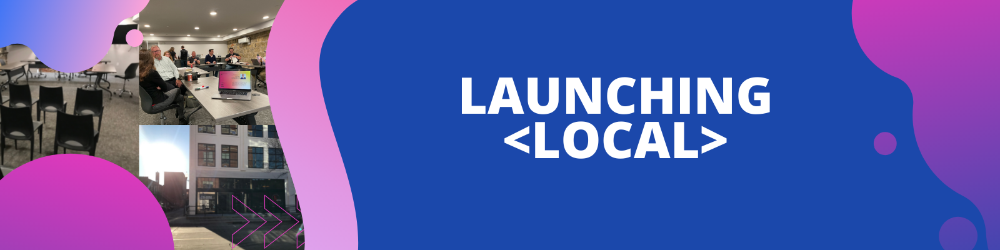
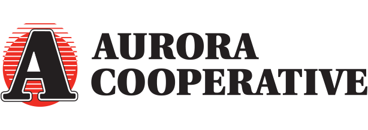
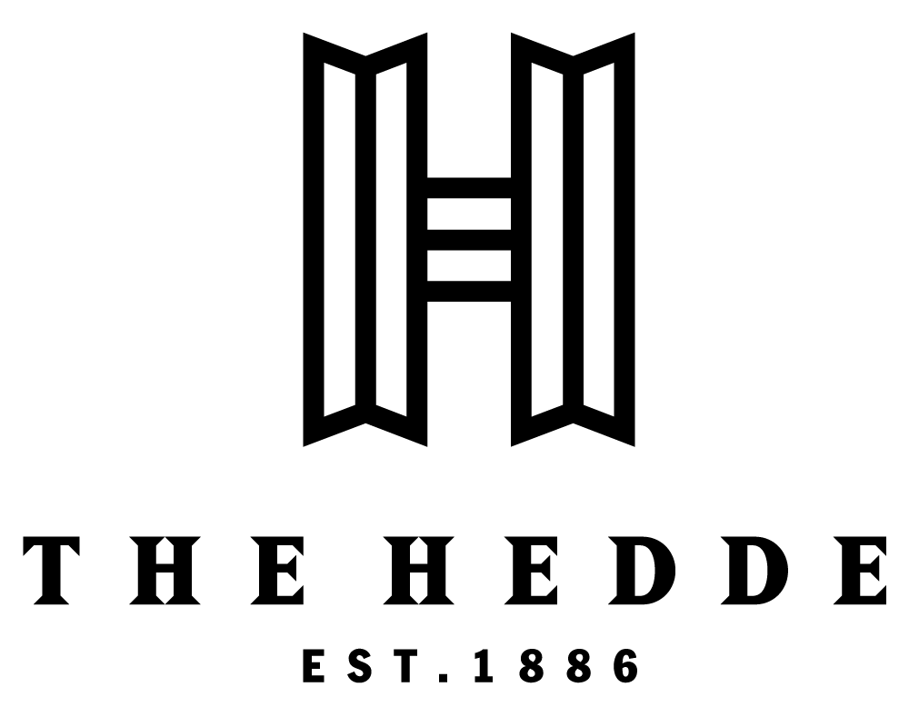
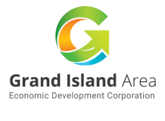
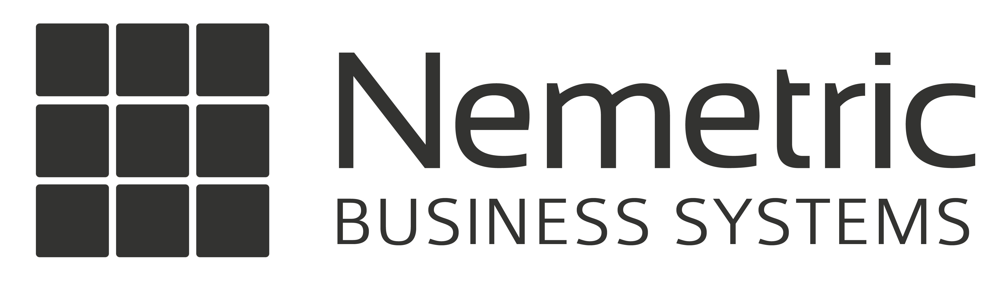
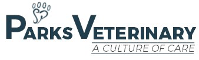

<a href="https://www.patreon.com/cofoundgi" >Become a Member!</a> or <a href="https://www.linkedin.com/company/cofoundgi/events" >Join us on LinkedIn</a>  

# Launching Local

CoFound is a community-driven approach to launching local.
​
​CoFound Grand Island exists to develop a startup culture in Grand Island and the surrounding area. This is accomplished through developing a community of founders, innovators, tech-minded individuals, and community leaders operating within a strong support network of local businesses and organizations.

# The Community

CoFound very intentionally resides inside The Hedde building downtown. This beautiful old building has been transformed into The Hedde Collective. The Hedde Collective is a co-working space specially designed for entrepreneurs and startups.

# The Network

CoFound has a growing network of partners and mentors.

<table class="notable">
<tr>
<td>

</td>
<td>

</td>
<td>

</td>
<td>

</td>
</tr>
<tr>
<td>

</td>
<td>

</td>
<td>

</td>
<td>

</td>
</tr>
</table>

<a href="https://www.patreon.com/cofoundgi" >Become a Member!</a> or <a href="https://www.linkedin.com/company/cofoundgi/events" >Join us on LinkedIn</a>  
