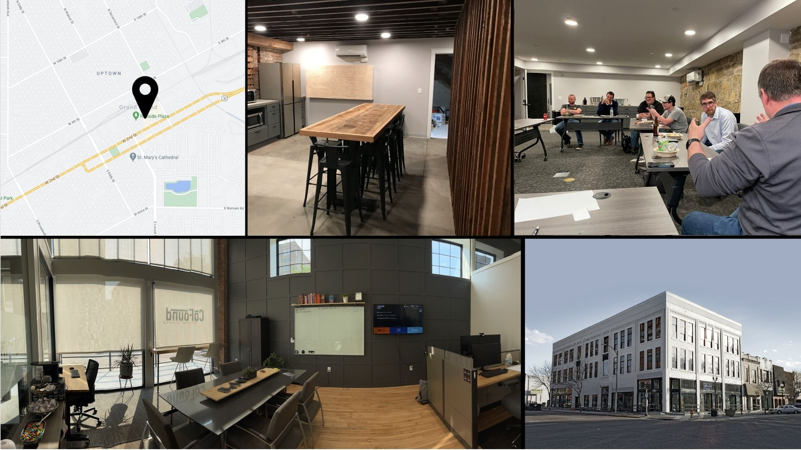

# Our BHAG(Big Hairy Audacious Goal)
<a href="https://www.patreon.com/bePatron?u=56517045" >Become a Member!</a> or <a href="https://www.linkedin.com/company/cofoundgi/events" >Join us on LinkedIn</a>   

### Startups = Growth

What exactly is a **"startup culture"**? A startup is simply a business with one key distinction... a high growth potential. Startups are formed by merging entrepreneurs with new ideas. Generally, we refer to them as founders. Founders are men or women who have created something new or have found a new way of thinking about an old problem. The startup culture is a highly intentional approach towards developing an environment to encourage and create founders.

### Why High Growth?

We have identified two problems in the Grand Island community. The lack of custom solution providers and the scarcity of potential jobs for future generations in technology. We know that high growth companies have a strong dependency on technology. If CoFound can encourage a thriving environment for custom solution providers, we will see the continued growth of the opportunities and capabilities of this community.

###### The Capacity Gap

The lack of custom solution providers is what we call the "Capacity Gap". Companies in the Grand Island area have grown to the size that they now demand custom solutions to problems. However, Grand Island currently does not have a strong ecosystem of custom software and hardware solution providers forcing companies to look outside of the Grand Island area to fill their unique needs.

###### The Workforce Gap

Grand Island's more urgent problem is the scarcity of technology jobs, we call this the "Workforce Gap". Grand Island has invested an incredible amount of resources and time into educating the next generations of future tech and entrepreneur types. However, with little opportunities locally, a large portion of these future innovators are forced to move out of the Grand Island area or worse, move on, giving up on their dreams of working in those fields.

<a href="https://www.patreon.com/bePatron?u=56517045" >Become a Member!</a> or <a href="https://www.linkedin.com/company/cofoundgi/events" >Join us on LinkedIn</a>  
